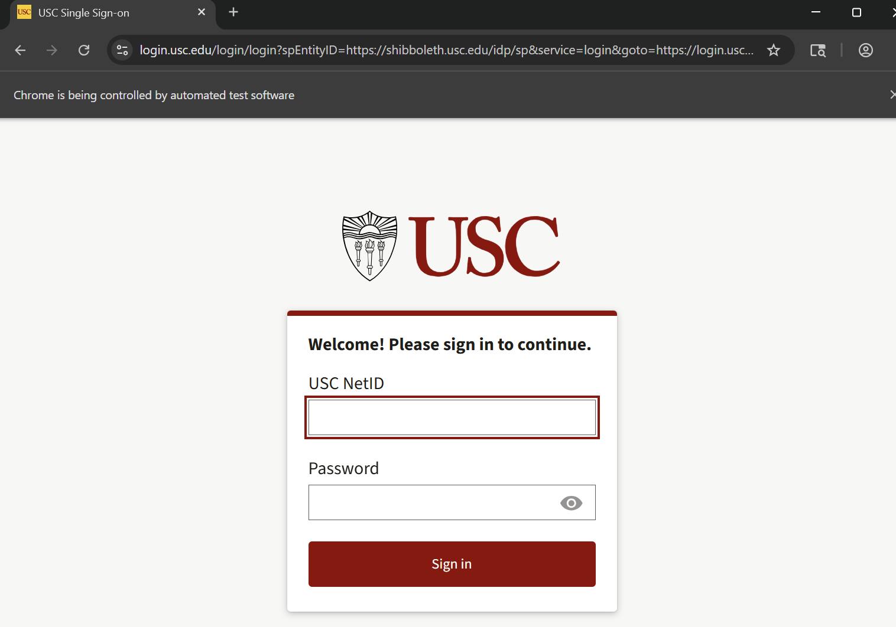
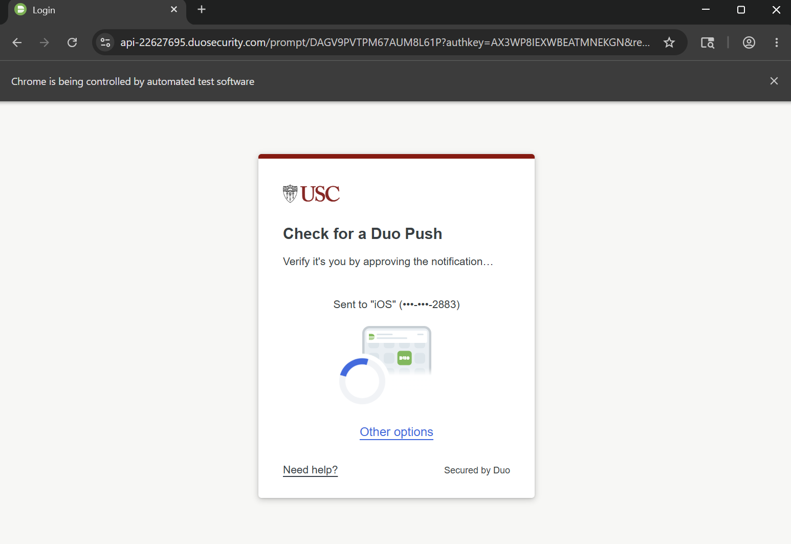
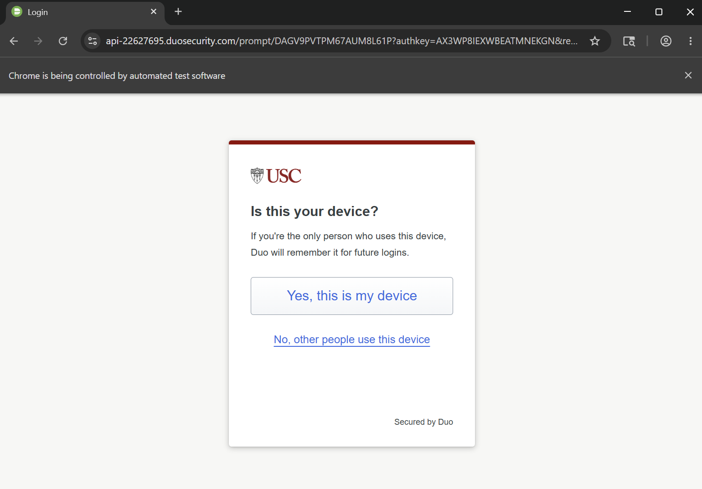

# USC Classes Web Scraper

A USC Web Reg web scraper that grabs all the section information of the given classes.

Last updated: 6/1/2026
## Setup Guide

### Prerequisites

Using the following setup on Windows 11 with steps also provided for Mac and Linux (untested)

'''console
$ python --version
Python 3.13.5
$ git --version
git version 2.50.1.windows.1
'''

The Selenium driver is tested with Chrome. However, it can also be configured to use Safari. 

If Python is not installed, the latest version can be installed [here](https://www.python.org/downloads/).

If git is not installed, the latest version can be installed [here](https://git-scm.com/install/).

### Setup

First, clone the repo

'''bash
git clone git@github.com:nelsonvo1234/USCScheduleWebScraper.git
'''

Then, cd into the directory

'''bash
cd USCScheduleWebScraper
'''

The setup assumes that you're in the USCScheduleWebScraper main directory. 

Then, create the virtual environment

Windows
'''bash
python -m venv .venv
'''

Mac/Linux (untested)
'''bash
python -m venv .venv
'''

Then, enter the virtual environment

Windows (Command Prompt)
'''bash
.venv\Scripts\activate.bat
'''

Windows (Powershell)
'''bash
.venv\Scripts\Activate.ps1
'''

Windows/Linux (untested)
'''bash
source .venv/bin/activate
'''

Next, install the necessary packages
'''bash
pip install selenium
pip install beautifulsoup4
pip install lxml
'''

If using Safari, run the following command (untested)
'''bash
safaridriver --enable
'''

Installation is now complete! 

### User Guide

To use the guide, run the following command in the venv.

'''bash
python ClassScraper.py [-s] [-i <input_file>] [-o <output_file>]
'''

input_file is the name of a txt file with list of classes with all department codes capitalized and class codes following, seperated by a hyphen. Classes should be seperated by a new line. An example is given
'''text
AME-101
AME-105
BME-101
CSCI-102
CSCI-103
EE-105
EE-109
'''

output_file is the name of the output csv which will contains data about all the sections.

Use '-s' flag if you want to use Safari (untested).

If no 'input_file' and 'output_file' are given, the program will run with default parameters 'Classes.txt' and 'Classes.csv'

After running the file, the following USC sign in will appear

Complete the sign-in and then Duo 2FA will appear. Complete the 2FA appropriately

Finally, a prompt to remember the device will appear. The input doesn't matter

Finally, Selenium will scrape through WebReg looking for the sections of the given classes. Please don't touch the tab while Selenium is scraping or who knows what will happen. Selenium will then close the tab and once the terminal finishes, the output should be store in 'output_file.csv'

Feel free to run infinite times within the venv. However, keep in mind that using the same output file multiple times will overwrite previous results.

### Cleanup

To leave the venv simply run
'''bash
deactivate
'''

And to destroy the venv run
'''bash
rm -r .venv
'''